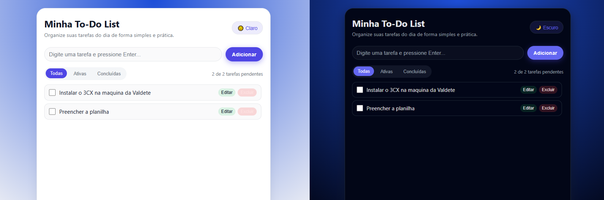

<h1 align="center">📝 To-Do List com Tema Claro/Escuro</h1>

<p align="center">
Aplicação de lista de tarefas com <b>modo claro/escuro</b>, criada com 
<strong>HTML, CSS e JavaScript</strong>, focada em boas práticas e experiência do usuário.
</p>

---

## 🚀 Demonstração

🔗 **Projeto Online (GitHub Pages):**  
https://andrewspedrini.github.io/todo-list-dark-light-mode/

---

## 📸 Preview do Projeto

<p align="center">
  
</p>

---

## 🛠 Tecnologias utilizadas

<p align="left">
  
  
  
</p>

---

## 📋 Sobre o projeto

Esse projeto foi criado com o objetivo de praticar:

- Manipulação do DOM com JavaScript  
- Armazenamento de dados no `localStorage`  
- Organização de arquivos (`index.html`, `style.css`, `script.js`)  
- Construção de uma interface amigável, responsiva e moderna  
- Alternância de temas com variáveis CSS  
- Boas práticas de código e lógica

---

## ✨ Funcionalidades

- Adicionar nova tarefa  
- Editar tarefas  
- Excluir tarefas  
- Marcar tarefas como concluídas  
- Filtros: Todas / Ativas / Concluídas  
- Tema claro e escuro com persistência  
- Interface responsiva  
- Tarefas salvas automaticamente no `localStorage`  

---

## 📁 Estrutura do projeto

```txt
todo-list-dark-light-mode/
│── index.html
│── style.css
│── script.js
│── preview-todo-list.png
└── README.md


▶️ Como executar localmente

Clone o repositório:

git clone https://github.com/AndrewsPedrini/todo-list-dark-light-mode.git


Entre na pasta:

cd todo-list-dark-light-mode


Abra o arquivo index.html no navegador.


💡 Aprendizados

Durante o desenvolvimento deste projeto, foram praticados:

Manipulação avançada do DOM

Uso de eventos e delegação de eventos

Persistência no navegador com localStorage

Alternância de temas usando classes e CSS variables

Estruturação e organização do código

Melhorias de UX e acessibilidade visual

🔧 Melhorias futuras

Animações nas transições de tema

Botão para excluir todas as tarefas concluídas

Adicionar data de criação da tarefa

Criar categorias/tags para organizar tarefas

Criar versão em React (futuro projeto)


👨‍💻 Desenvolvido por

Andrews Vinicius Aparecido Pedrini
🔗 LinkedIn: https://linkedin.com/in/andrews-pedrini

